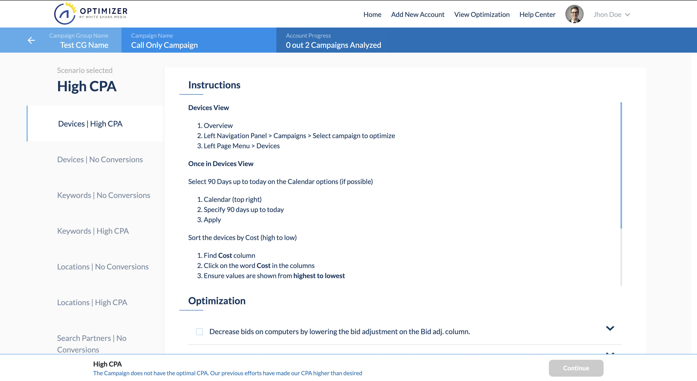
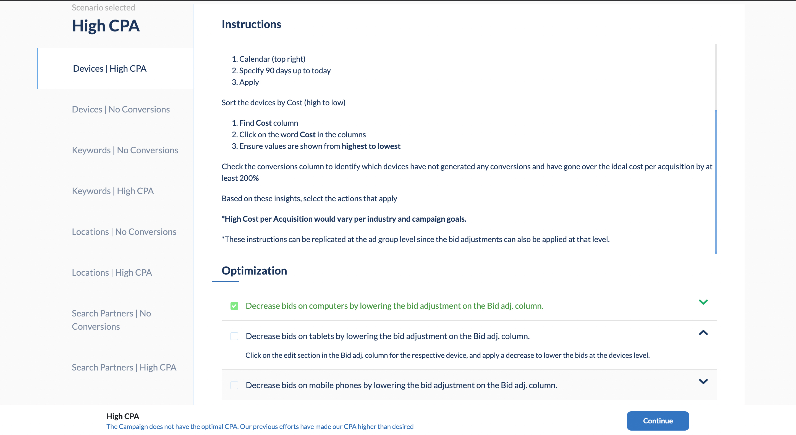

# **WSM Angular test FPP**
---
# Introduction

This application is about an angular test. 

&nbsp;

# Demo 

&nbsp;

# technologies used 🛠️

- HTML5, CSS3, Typescript.
- Angular Framework version 12.1.3
- NodeJS version 14.17.3
- Bootstrap Framework version 5.0.2
- Animate.css Library.

# Instructions 🚀 

1. git clone https://github.com/faustopossopaz/wsm-angular-test-fpp.git
2. cd wsm-angular-test-fpp
2. Execute the command `npm install`.
3. Run Angular `ng serve`.
\
&nbsp;

# Author ✒️
 - Fausto Posso. 

---
⌨️ with ♡ by Fausto Posso Paz.
\
&nbsp;
